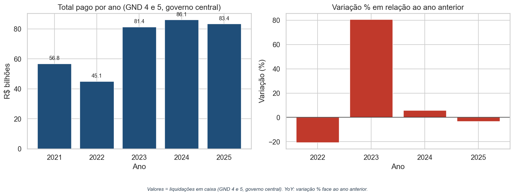
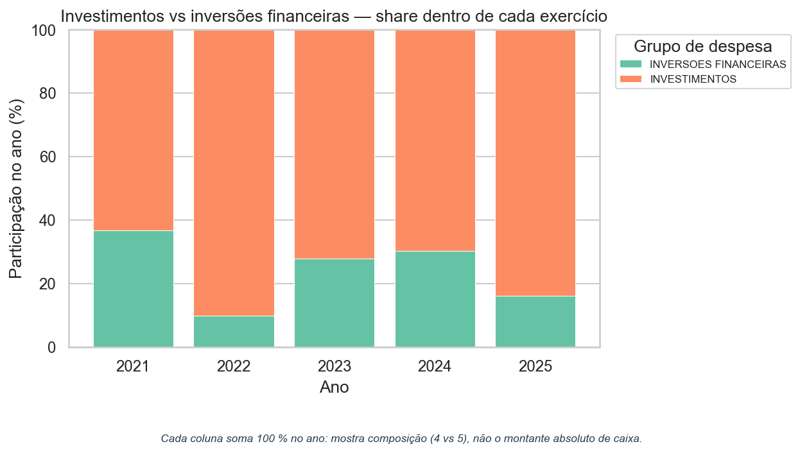
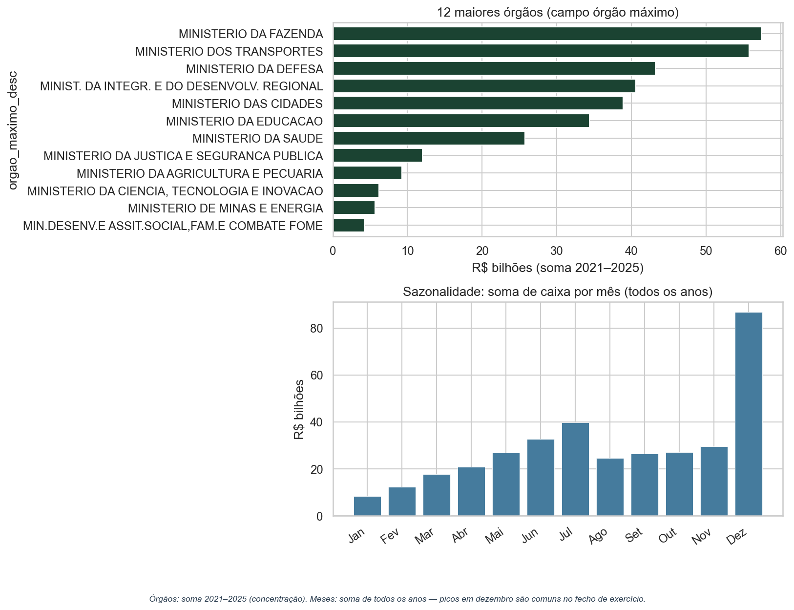
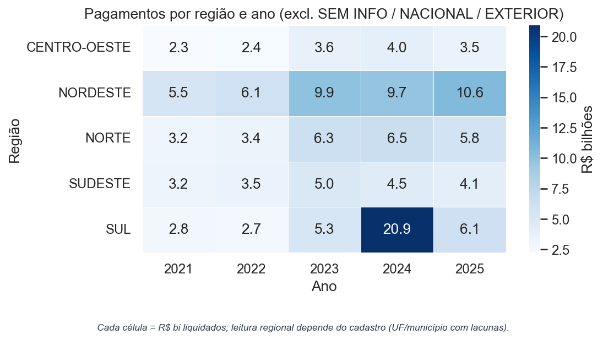
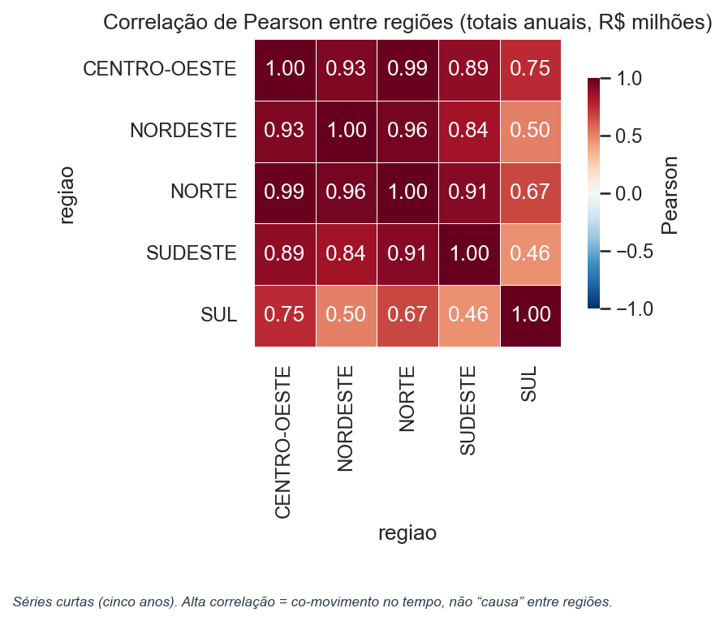

# Pagamentos federais em investimentos e inversões financeiras (GND 4 e 5): relatório exploratório (2021–2025)

## Introdução

No Brasil, a execução orçamentária federal está integrada a um sistema constitucional que, além de outros princípios da administração pública, fundamenta a publicidade e a eficiência em divulgações sobre as despesas e em sistemas de registro financeiro. Em geral, o SIAFI (Sistema Integrado de Administração Financeira) é a referência operacional para a maioria dos movimentos que são divulgados em portais de transparência e em conjuntos de dados abertos. Nesse contexto, o presente relatório delimita pagamentos que pertencem aos grupos da natureza da despesa (GND) 4 — investimentos, em sentido orçamentário — e 5 — inversões financeiras —, referentes ao governo central, entre 2021 e 2025. A avaliação se refere ao fluxo de caixa que foi liquidado: não se deve confundir isso com empenho, com a fase de liquidação jurídica isolada, nem com metas físicas ou os resultados das políticas públicas. 
O propósito é descrever e interpretar agregados temporais, a composição entre grupos 4 e 5, a concentração institucional, a esfera e a função de governo, o padrão mensal de liquidação e indicadores regionais, sempre estabelecendo filtros claros de qualidade cadastral e definindo os limites metodológicos. Além disso, busca-se conectar os dados a reflexões sobre transparência, prestação de contas (accountability) e suas implicações no debate sobre políticas públicas, sem a intenção de testar hipóteses causais ou avaliar impactos sociais. O texto está estruturado em um problema e fundamentação, resultados exploratórios acompanhados de ilustrações, uma discussão sobre a governança da informação e a responsabilidade, uma conclusão e referências bibliográficas.
Operacionalmente, o trabalho assenta num pipeline reprodutível: leitura de ficheiros CSV e XLSX, normalização da variável valor_reais, armazenamento em Parquet para ágil reexecução, análise no notebook exploracao_investimentos.ipynb e, opcionalmente, exportação para DOCX por meio de scripts/export_relatorio_docx.py. Os acrônimos e expressões técnicas empregados no corpo do texto estão sucintamente definidos na tabela a seguir, para facilitar a leitura independente do relatório.

## Nota sobre termos e siglas

| Termo ou sigla                       | Significado (neste relatório)                           |
| ------------------------------------ | ------------------------------------------------------- |
| **R$ bi**                            | Bilhões de reais (10⁹ R$).                              |
| **Accountability**                   | Prestação de contas a interlocutores.                   |
| **GND**                              | Natureza da despesa; 4 = invest., 5 = inv. financeiras. |
| **SIAFI**                            | Sistema Integrado de Administração Financeira.          |
| **Governo central**                  | Recorte dos ficheiros (metadados).                      |
| **Empenho / liquidação / pagamento** | Compromisso → crédito reconhecido → caixa (foco aqui).  |
| **UO**                               | Unidade orçamentária.                                   |
| **RP**                               | Restos a pagar.                                         |
| **YoY**                              | Variação vs ano anterior.                               |
| **Decomposição YoY**                 | Desdobrar variação (4/5, órgão, mês).                   |
| **HHI**                              | Herfindahl-Hirschman (concentração).                    |
| **CV**                               | Coeficiente de variação.                                |
| **OSC**                              | Organização da sociedade civil (sem fins lucrativos).   |
| **RTN**                              | Resumo do Tesouro Nacional.                             |
| **UF**                               | Estado ou DF.                                           |
| **IBGE**                             | Denominadores regionais (futuro).                       |
| **Pearson**                          | Correlação linear; não causalidade.                     |
| ***Snapshot***                       | Corte temporal do ficheiro (2025).                      |
| ***Drill-down***                     | Desagregar até ação/programa.                           |

---

## 1. Problema público e justificativa

### 1.1 Contexto e pergunta

GND 4/5 fazem distinções entre as naturezas orçamentárias; os dados referem-se a liquidações públicas, não sendo “obra entregue” nem resultado de política. Frequentemente, confunde-se caixa, empenho e resultado. Questão: de que maneira se distribuem os pagamentos por exercício, órgão máximo, função e macro-região, e que inferências apoiam a concentração, a sazonalidade e uma leitura crítica? Relevância: para a fiscalização e uma opinião bem-informada, embora com limites (cadastro geográfico, cinco anos nas correlações, assimetria por linha).

---

## 2. Bases de dados e preparação

### 2.1 Fontes

| Fonte                                  | Conteúdo            |
| -------------------------------------- | ------------------- |
| `investimentos_2021.csv` … `2024.csv`  | `;`, valores BR     |
| `investimentos-2025.xlsx`              | 2025 numérico       |
| `metadados-investimentos.pdf`          | Definições e notas  |
| `data/investimentos_2021_2025.parquet` | Unificação (script) |

### 2.2 Variáveis e pipeline

Ano, mês, esfera, órgão máximo, UO, grupo 4/5, função/subfunção, programa/ação, região, UF, município, `valor_reais`, `_fonte_arquivo`. Encodings UTF-8/UTF-8-SIG/LATIN-1; parsing monetário BR + Excel. Análise: agregados, HHI, sazonalidade, região × ano, Pearson (macro-regiões, rótulos espúrios excluídos).

### 2.3 Qualidade (síntese numérica)

243 259 linhas; Σ `valor_reais` ≈ 352,8×10⁹ R$; distribuição assimétrica (mediana 0; CV ≈ 22,5). Negativos ~0,27% (estornos) — manter nos totais. UF ausente: 29,0%; município: 78,6% — região como aproximação. Correlações: co-movimento, não efeito cruzado. Exercício 2025: corte temporal do ficheiro (snapshot); ver metadados.

---

## 3. Resultados da análise exploratória

### 3.1 Totais anuais e variação YoY

| Ano  | Total (R$ bi) | Variação % vs anterior |
| ---- | ------------- | ---------------------- |
| 2021 | 56,83         | —                      |
| 2022 | 45,05         | −20,7 %                |
| 2023 | 81,37         | +80,6 %                |
| 2024 | 86,10         | +5,8 %                 |
| 2025 | 83,41         | −3,1 %                 |

2022↓ e 2023↑: RP, *mix* 4/5 e reclassificações — não bastam para rotular só “austeridade” ou “expansão”.

### 3.2 Composição % GND 4 versus 5

| Ano  | Inv. fin. (%) | Invest. (%) |
| ---- | ------------- | ----------- |
| 2021 | 36,6          | 63,4        |
| 2022 | 9,8           | 90,2        |
| 2023 | 27,8          | 72,2        |
| 2024 | 30,2          | 69,8        |
| 2025 | 16,2          | 83,8        |

*Mix* instável: explicitar natureza contabilística e calendário no discurso sobre “investimento”.

### 3.3 Concentração (órgão máximo)

HHI ≈ 0,109. Pareto: 5 órgãos ≈ 66,9%; 10 ≈ 91,7%. Os órgãos mais relevantes são: Fazenda, Transportes, Defesa, Integração e Cidades — que são coerentes com o orçamento federal, mas não provam eficiência nem preferência isolada.

### 3.4 Esfera e função

Fiscal: ≈ 90,5%; Seguridade: ≈ 9,5%. Predominam encargos especiais, transporte, defesa nacional (rótulos agregados).

### 3.5 Região (após exclusões)

Excl.: SEM INFORMACAO, CODIGO INVALIDO, NACIONAL, EXTERIOR. R$ bi:

| Ano  | C-Oeste | Nordeste | Norte | Sudeste | Sul   |
| ---- | ------- | -------- | ----- | ------- | ----- |
| 2021 | 2,25    | 5,53     | 3,20  | 3,24    | 2,79  |
| 2022 | 2,40    | 6,08     | 3,35  | 3,54    | 2,68  |
| 2023 | 3,64    | 9,93     | 6,25  | 4,99    | 5,27  |
| 2024 | 4,01    | 9,75     | 6,53  | 4,47    | 20,92 |
| 2025 | 3,46    | 10,58    | 5,80  | 4,09    | 6,13  |

Sul/2024: reserva — *drill-down* + fontes antes de narrativa regional forte.

### 3.6 Sazonalidade

Dezembro: ~18,5 %–29,4 % do caixa anual — fecho de exercício.

### 3.7 Figuras e interpretação

Níveis e YoY (tabela 3.1); sem desagregar 4/5 não se identifica o choque 2022/2023 internamente.

*Share* por ano; 2022 dominado por 4 vs 2021 com mais 5 — checar ações por trás das fatias.

Órgãos (cf. 3.3) e soma mensal; dezembro = ritmo de exercício (cf. 3.6).

Sul/2024 = hipótese de investigação, não prova de prioridade regional.

Co-movimento em séries curtas; não causalidade; uso exploratório.

---

## 4. Contabilidade: accountability, governança e políticas públicas

### 4.1 Leitura integrada

A volatilidade, o *mix* 4/5, a concentração, o mês de dezembro e a fraca leitura regional atenuam as “prioridades” que dependem apenas de caixa.

### 4.2 Accountability: vertical, horizontal, and social

A prestação de contas ocorre em três dimensões: vertical (entre níveis da hierarquia, entre o Executivo e o Legislativo, entre o Executivo e os Tribunais de Contas), horizontal (entre agências, entre diferentes partes do governo) e social (entre agências e a sociedade civil, entre agências e a imprensa, entre agências e especialistas, entre agências e ONGs), com os dados abertos destacando as dimensões social e horizontal. Transparência não é igual a contas efetivas desprovidas de um método e da conexão entre empenho, produto e meta, o que pode resultar em uma vigilância meramente simbólica. Cruzamento com o RTN, relatórios gerenciais, auditorias e avaliações.

### 4.3 Informação e sua governança

Lacunas UF/município criam desigualdade e impedem uma responsabilização territorial equitativa. Poucos órgãos, muita concentração: clássico do federal, mas perigo de titulares pontuais e outliers regionais.

### 4.4 Implicações e ética do território

Gestores: detalhar YoY (4/5, órgão, mês), monitorar programas, comparar liquidação com entrega real. Fiscalização externa: questões de auditoria, não verificação. Comunicação: legendas poderosas que vão além de "pagamentos". Quando se trata do território, não devemos empregar denominadores nem fazer comparações entre UFs, já que os mapas apenas funcionam como suposições.

---

## Análises Finais

Esse mapeamento exploratório dos pagamentos federais em GND 4 e 5, entre 2021 e 2025, em regime de caixa do governo central, pode ser resumido em cinco grandes eixos. Primeiramente, constata-se uma grande volatilidade interanual do total, o que desaconselha tirar conclusões sobre uma tendência estrutural com base em um único ano. Em segundo lugar, a relação entre investimentos e inversões financeiras varia bastante: o debate público sobre “investimento” deve distinguir natureza orçamentária, calendário de liquidação e resultado de política. Em terceiro lugar, existe uma alta concentração em um pequeno número de órgãos máximos, o que é consistente com a estrutura do orçamento federal, mas ainda assim requer uma avaliação cuidadosa em relação aos programas e aos seus responsáveis. Quarto, a sazonalidade significativa em dezembro espelha o fechamento do exercício. Quinto, a leitura regional ainda depende de lacunas cadastrais e de eventos esporádicos, como se viu no Sul em 2024.

A reprodutibilidade técnica (Parquet, notebook e scripts) no que toca à prestação de contas e à governança do que foi produzido socialmente reforça o controle social ao se integrar a ecossistemas de informação mais amplos — RTN, relatórios de gestão, auditorias e, quando houver, avaliações de programas. A transparência dos dados é uma condição essencial, mas não é suficiente para garantir uma responsabilização eficaz: é fundamental ter a capacidade de análise, comparações apropriadas e canais institucionais para a resposta.

Entre as continuidades sugeridas para futuras pesquisas, está a proposta de relacionar os fluxos de caixa com empenhos e metas físicas dos programas; incluir denominadores regionais (por meio do IBGE) nas análises per capita ou relativas ao produto; e investigar, através de um detalhamento orçamentário, as ações que esclarecem outliers temporais e territoriais. Dessa forma, chega ao fim um ciclo de descrição e interpretação cautelosa dos dados, permitindo a entrada de investigações mais sistematizadas no campo da ciência de dados aplicada ao setor público.

---

## Referências

BRASIL. Constituição da República Federativa do Brasil, 1988 (arts. 37 e 6º). Ajustar ABNT.

BRASIL. Portal da Transparência. [https://www.portaldatransparencia.gov.br/](https://www.portaldatransparencia.gov.br/) (acesso: 12 abril 2026).

`metadados-investimentos.pdf` (repositório).

IBGE. [https://www.ibge.gov.br/](https://www.ibge.gov.br/) (acesso: 05 abril 2026).

BRUCE, Andrew; BRUCE, Peter. *Estatística prática para cientistas de dados: 50 conceitos essenciais*. 1 jul. 2019.

DUARTE, Nancy. *Data Story: explique dados e inspire ações por meio de história*. 25 jan. 2022.

GRUS, Joel. *Data science do zero — 2.ª ed.: noções fundamentais com Python*. 30 mar. 2021.

MATTHES, Eric. *Curso intensivo de Python*. 19 mai. 2016.

NETTO, Amilcar; MACIEL, Francisco. *Python para Data Science: e machine learning descomplicado*. 8 jul. 2021.

SWEIGART, Al. *Automatize tarefas maçantes com Python*. 10 ago. 2015.

VANDERPLAS, Jake. *Guia do Python para data science: tradução da 2.ª edição — ferramentas essenciais para trabalhar com dados*. 30 abr. 2025.